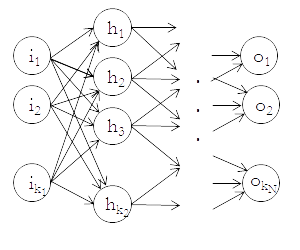

Multilayer perceptron is a basic feed-forward neural network that maps sets of data into output categories. It is best used for classification of inputs into groups.

NNX implementation of multilayer perceptron has the following properties:

* Every node in a given layer is connected to every node in preceding and succeeding layers.
* Hidden layer activation function is \\(\tanh\\).
* Output layer activation function is [softmax](https://en.wikipedia.org/wiki/Softmax_function).
* Backpropagation assumes that the error is calculated using [cross-entropy error function](nnGetCrossEntropyError.html).

In NNX nomenclature, for multilayer perceptrons (and any other neural networks) the input layer is layer 0, first hidden layer is layer 1, and the first layer of weights is the set of weights for connections between input and hidden layers.  All remaining layers are numberered in increasing order.

## Functions

Multilayer perceptrons can be created using:

* [`nnMakeMultilayerPerceptron`](nnMakeMultilayerPerceptron.html): directly creates a multilayer perceptron and assigns weights to all connections.
* [`nnTrainMultilayerPerceptron`](nnTrainMultilayerPerceptron.html): trains a multilayer perceptron given a trainer, a training set, and some additional arguments.

## Calculation details

### Feed forward

Given:
* A perceptron with layers \\(0, 1, ..., N\\), where layer \\(0\\) is the input layer and layer \\(N\\) is the output layer,
* \\(k_a\\) nodes per layer for each layer \\(0 \leq a \leq N\\), with the final \\(k_a\\)-th node always set to 1 and representing the bias (except for output layer, which does not have bias),
* for each layer \\(1 \leq a \leq N\\), the weights \\(\mathbf{w}\_a = [w_a (1, 1), w_a (1, 2), ... , w_a (k_{a-1}, k_a - 1)]\\) for connections between each node between layer \\(a\\) and layer \\(a - 1\\),
* input and hidden layer nodes \\(h_{i_a}^a\\) for \\(1 \leq a \leq N-1\\) and \\(0 \leq i_a \leq k_a\\),

The feed-forward algorithm for a multilayer perceptron works as follows.  For hidden layers \\(1 \leq a \leq N-1\\), value of a hidden node \\(h_{i_a}^l\\) is given by \\(\tanh\\) of linear combination of node values for the preceding layer:

\begin{equation*}
h_{i_a}^a = \tanh\left( \sum_{j = 1} ^ {k_{a-1}} w_a (j, i_a) h_{j}^{a - 1} \right)
\end{equation*}

This calculation is performed from first hidden layer to last, iteratively using nodes from each calculated layer to determine values for the next layer.

Then, to calculate values for output layer nodes, the multilayer perceptron first calculates a pre-output value \\(o_i^\prime\\) for each \\(1 < i < k_N\\) by taking a linear combination of last hidden layer's nodes

\begin{equation*}
o_i^\prime = \sum_{j = 1} ^ {k_{l-1}} w_N (j, i) h_{j}^{N - 1}
\end{equation*}

and uses softmax to calculate the final output values:

\begin{equation*}
o_i = \frac{o_i^\prime}{\sum_{j = 1} ^ {k_N} o_j^\prime }
\end{equation*}

These are the final values that are produced when using [`nnFeedForward()`](nnFeedForward.html) on multilayer perceptron.

### Gradient calculation

The neural network's gradient calculation is used by trainers like [`SimpleGradientTrainer`](nnMakeSimpleGradientTrainer.html) to determine the adjustment to make in each backpropagation step.  For this multulayer perceptron, gradient calculation assumes that cross-entropy error is used as the error function that determines how close the neural network got to the expected outputs.

The gradient calculation is given as follows.  Given: 

* \\(E\\): error function (cross-entropy error of targets relative to outputs).
* \\(N\\): number of hidden and output layers.
* \\(a\\): a layer between \\(0\\) (input) and \\(n\\) (output), inclusive.
* \\(i_a\\): \\(i\\)-th node in layer \\(a\\).
* \\( \mathbf{o} = (o_1, ..., o_{i_N})\\): neural network outputs for the given inputs.
* \\( \mathbf{t} = (t_1, ..., t_{i_N})\\): neural network training targets for the given inputs.
* \\(h_{i_a}\\): value of \\(i\\)-th hidden (or input, or output) node in layer \\(a\\) after activation.
* \\(h_{i_a}^\prime\\): value of \\(i\\)-th node in layer \\(a\\) before activation (so \\(h\_{i_a} = \tanh h\_{i_a}^\prime\\)) .
* \\(w_a (i_{a-1}, i_a)\\): weight of \\(i_{a-1}\\)-th node in layer \\(a-1\\) in activation of \\(i_a\\)-th node in layer \\(a\\).
* \\(\mathbf{w} = (w_1(1, 1), ..., w_N (k_{N-1}, k_N))\\): collection of all weights in the neural network.

Note that indexes \\(i_a\\) and \\(i_{a-1}\\) may have different values.

Then, for each weight \\(w_a (i_{a-1}, i_a)\\), the partial derivative of the error function with respect to the weight is given by

\begin{equation*}
\frac{\partial E}{\partial w_a (i_{a-1},i_a)} = h_{i_{a-1}}\frac{\partial E}{\partial h\_{i_{a}^\prime}}
\end{equation*}

where for layer \\(N\\) (output)

\begin{equation*}
\frac{\partial E}{\partial \bar{h}\_{i_{n}}} = o\_{i_n} - t_{i_n}
\end{equation*}

and for any preceding layers \\(1 \leq a < N\\) it is given recursively by

\begin{equation*}
\frac{\partial E}{\partial h\_{i_{a}^\prime}} = (1-h^2_{i_a})\sum_{j_{a+1}}w_a (i_a, j_{a+1})\frac{\partial E}{\partial h\_{j_{a+1}}^\prime}
\end{equation*}

The overall gradient is then the collection of partial derivatives of \\(E\\) with respect to each weight:

\begin{equation*}
\nabla E(\mathbf{w}) = \left( \frac{\partial E}{\partial w_1(1,1)}, ...,  \frac{\partial E}{\partial w_N(k_{N-1}, k_N)} \right)
\end{equation*}

## Layout of weights

This section may be useful if you wish to directly provide the weights for multilayer perceptron, or if you wish to figure out what the result of [`nnGetWeights()`](nnGetWeights.html) produces.

The weights of the perceptron are represented as an array of arrays, with each internal array representing an individual layer of connections between the layers.  The first array represents the weights of the the connections between the input layer and the first hidden layer, and subsequent arrays represent connections between later layers, with final array of weights being the weights of connections between final hidden layer and output layer.

$$

$$
