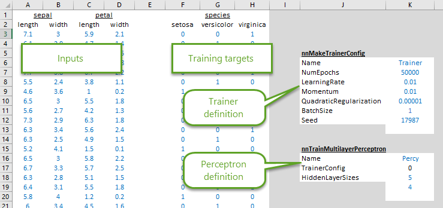
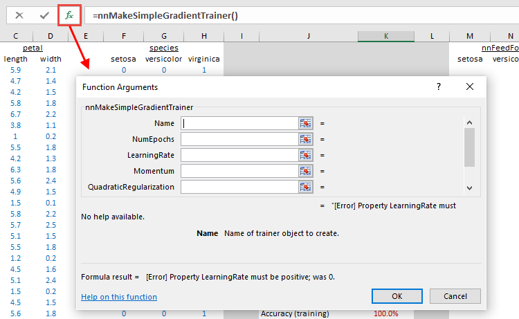
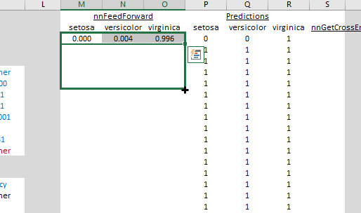

## Getting started

Before starting, make sure you have downloaded and installed latest version of NNX. You can get it on the [main page](/).  If you don't already have it, NNX addin will ask you to install [.NET framework 4.6 runtime](https://www.microsoft.com/en-us/download/details.aspx?id=48130). Needless to say, Excel is required.

## Creating a trainer

To start, download a [starter workbook](Iris-flower-data-set-starter.xlsx). Alternatively, if you wish, you can download the [fully completed sample workbook](Iris-flower-data-set.xlsx).

NNX offers two ways to define neural networks: 

1. Directly create a neural network and set its weights, or 
2. Create a trained neural network from training inputs.  

We'll take the second approach first.

The sample workbook contains the famous [Fisher's iris flower data set](https://en.wikipedia.org/wiki/Iris_flower_data_set). It has already been randomized, and split into a training set and a testing set, with inputs for training and neural network definition ready to go.



Let's start by creating a trainer. In cell `K13`, start typing in `=nnMakeSimpleGradientTrainer(` (Excel should offer to auto-complete that). Then, click  on the \\(f_x\\) symbol near the formula bar. This should open the formula dialog:



Fill in the function arguments with corresponding inputs from cells `K6` to `K12`. When done, formula in cell `K13` should read:

```
=nnMakeSimpleGradientTrainer(K6,K7,K8,K9,K10,K11,K12)
```

Submitting that will create a new NNX trainer object named "Trainer" (you can pick any other name).  You can find out more about [`nnMakeSimpleGradientTrainer()`](reference.html#nnMakeSimpleGradientTrainer) and its arguments by reading the [NNX function reference](reference.html).

## NNX objects

NNX add-in works by creating various objects: trainers, neural networks, sets of weights, and other objects, and then acting on these objects to do something useful.  All objects can be referenced by their name, like object named "Trainer" that we just created. Object names are critical for NNX, and for this reason most NNX functions require name of the object to create or act on as their first argument.

You can delete all NNX objects at any time by calling function [`nnClearObjects()`](reference.html#nnClearObjects). Make sure to delete this function after you've called it so it does not keep deleting your objects every time you recalculate the workbook.

Creating another object with the same name as an existing object will overwrite the existing object, and will cause all references to the old object to point to the new object. This can be sometimes conveniently exploited.

## Training a perceptron

Now that we have a trainer, we can use it to train a [multilayer perceptron](https://en.wikipedia.org/wiki/Multilayer_perceptron). Type in or paste the following formula in cell `K20`:

```
=nnTrainMultilayerPerceptron(K16,K17,A33:D152,F33:H152,K18:K19)
```

This will crate and train a multilayer perceptron named "Percy". The function will automatically determine the number of input and output nodes based on the inputs, though it needs to be provided number of hidden nodes to use. In this case, Percy will have 5 nodes in the first hidden layer and 4 nodes in the second. This is a bit of overkill for such simple input/output set, and will likely result in overfitting, but it's good for illustrating abilities of NNX.

Note that the second argument, `K17`, refers to the trainer we created above through another formula reference. When formulas depend on previously created objects, it's a good idea to refer to the previously created objects by their cell reference rather than by name directly.  If we would have typed  `=nnTrainMultilayerPerceptron(K16,"Trainer",A33:D152,...` instead, there is a chance that Excel formula evaluation engine would have evaluated `=nnTrainMultilayerPerceptron()` before creating the trainer using `=nnMakeSimpleGradientTrainer()`, resulting in error.

## Using a perceptron

To use Percy the perceptron to evaluate new data points, we'll use function [`nnFeedForward()`](reference.html#nnFeedForward). In cell `M3`, type in 

```
=nnFeedForward($K$20,A3:D3)
```

Once you'll hit enter, you'll notice that the function outputs have automatically expanded to nearby cells. All NNX functions that output arrays do this, so you'll need to watch out for accidentally overwriting existing cells. In this case, we've strategically left empty cells to the right of the original formula cell.

You can now select the three cells, click on the square on the bottom right, and drag down to fill the formulas in cells all the way to the bottom.



Results in the "Predictions" columns should automatically update to show the neural network's best guess for the each sample's species.

To see how well our neural network did, in cell `S3` enter 

```
=nnGetCrossEntropyError(F3:H3,M3:O3)
```

and then copy the cell and paste it in all cells below. When done, formulas in cells `K23` and `K24` should show the average errors for training and testing sets respectively. If prefer mean square error instead of cross-entropy error, you can replace [`nnGetCrossEntropyError(reference.html#nnGetCrossEntropyError)`]() with [`nnGetMeanSquareError()`](reference.html#nnGetMeanSquareError).

## Directly creating a perceptron

We can't always re-train a neural network every time we want to use it.  Sheet 2 shows how to extract weights from Percy the perceptron using `nnGetWeights()`, and then repackage them into another identical perceptron named Percy2 using `nnMakeArray()`, `nnMakeWeights()` and `nnMakeMultilayerPerceptron()`.  If you'd like to provide the weights yourself instead of using weights from a perceptron created by NNX, be sure to carefully follow the layout of weights arrays given in function reference for [`nnMakeMultilayerPerceptron()`](reference.html#nnMakeMultilayerPerceptron).

## Next steps

That's it for the tutorial. To see more NNX functions and more details on them, head over to the [NNX function reference](reference.html).  


